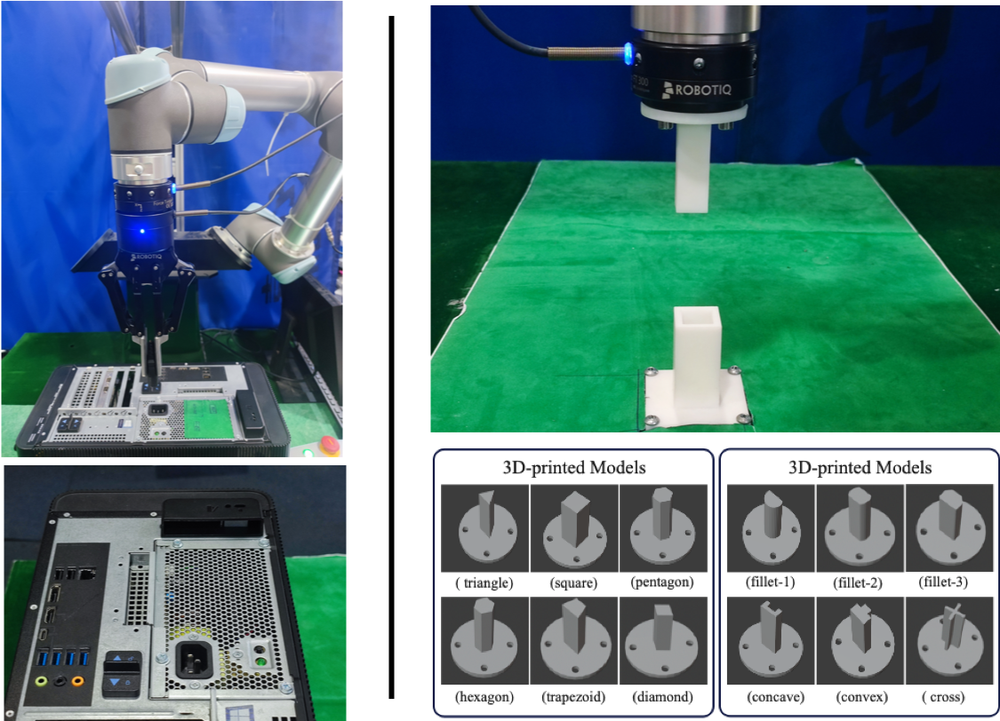
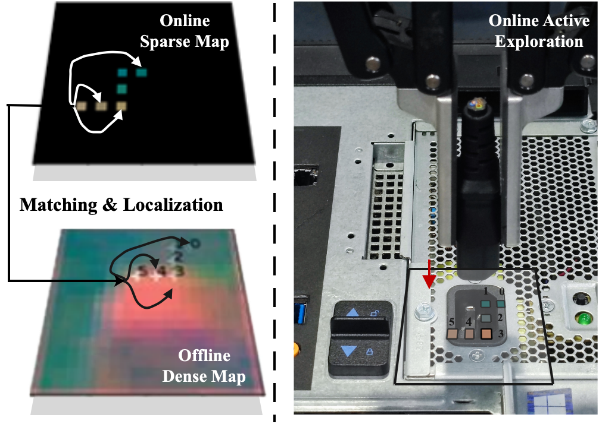

# Tracer: a Transformer-based Active Locator for sub-mm hole localization

> Hole localization is a general skill of autonomous robotic systems. A desirable property is to enable robots to operate in contact-rich environments with tight tolerances and generalize to new tasks with unseen peg-hole pairs. To this end, we introduce the Transformer-based Active Locator (Tracer), an algorithm for sub-mm peg-in-hole by formulating the task as a matching and contact point localization problem. We propose matching a sparse map to a dense one to achieve precise local- ization. The dense map, pre-collected offline, is a hole-centered N × N × n square array arranged with an n-dimensional force- torque vector. The sparse map, generated online, is designed to store the contact trajectory, which consists of a series of historical force-torque vectors. Tracer leverages self- and cross-attention layers in transformers to establish the correspondences between the maps. Additionally, Tracer introduces an RL-based policy to guide the generation of the sparse map with active trajectory exploration. To obtain training data for Tracer, we design a high-precision simulator where enormous data with ground truth labels are easy to access. Experiments demonstrate that the proposed Tracer outperforms other competitive approaches and achieves a 90% success rate on the 12 unseen 3D models and a variety of unseen tight workpieces. Within 5 minutes of fast adaption, the performance can be further improved by over 95%.

|  |  | 
|:--:|:--:|

## Demonstrations

__The 3-DoF peg-in-hole process.__ The peg is placed randomly in a
given region. Then the gripper is controlled to grasp the peg. There exists grasping error due
to the randomization. Our proposed approach leverages force-torque feedback to localize the
precise hole position. When the position alignment is achieved between the peg and the hole,
the peg is pushed into the hole compliantly to finish insertion. Finally the peg is released by
the gripper

- C320-C13

|  |  |  |
|:--:|:--:|:--:|

- USB

|  |  |  |
|:--:|:--:|:--:|

- 3-pin Electric Plug

|  |  |  |
|:--:|:--:|:--:|

More video demonstrations are available at [Bilibili](https://www.bilibili.com/video/BV1xK411U71q/?spm_id_from=333.999.0.0&vd_source=607a93301df2e521df43ecab79ab1dec)

<!-- - Others

 -->

## Supplementary Materials
- Videos: [Link](https://www.bilibili.com/video/BV1xK411U71q/?spm_id_from=333.999.0.0&vd_source=607a93301df2e521df43ecab79ab1dec)
- Appendix: [Link](https://github.com/xieliang555/Tracer/blob/main/assets/RAL_supplementary.pdf)
- Paper: Coming soon
